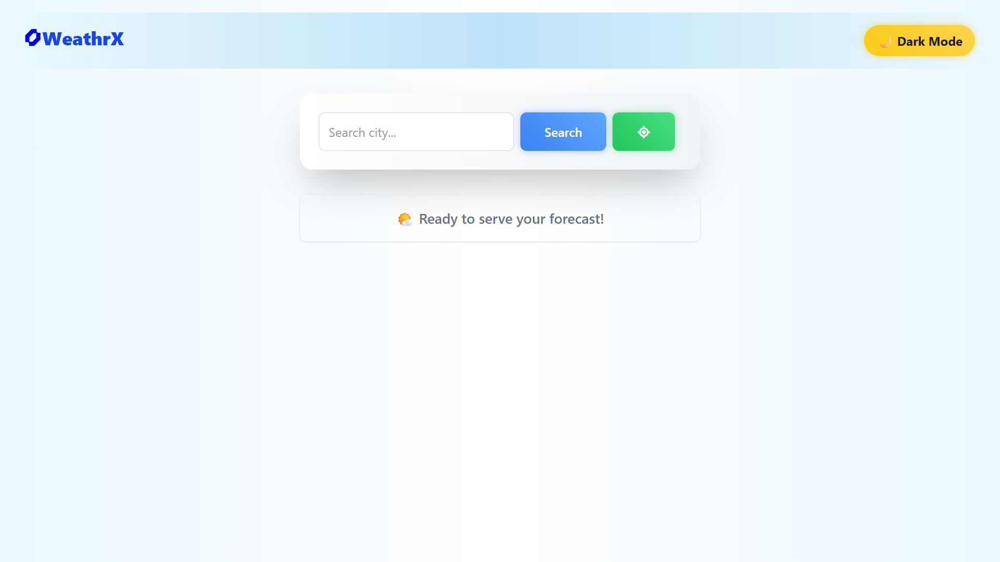
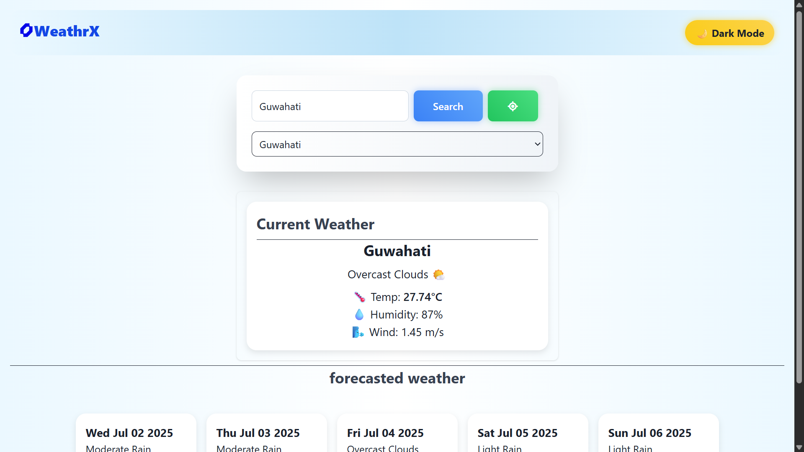
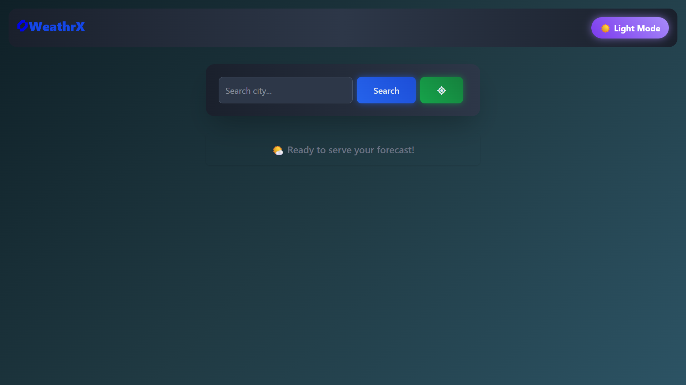
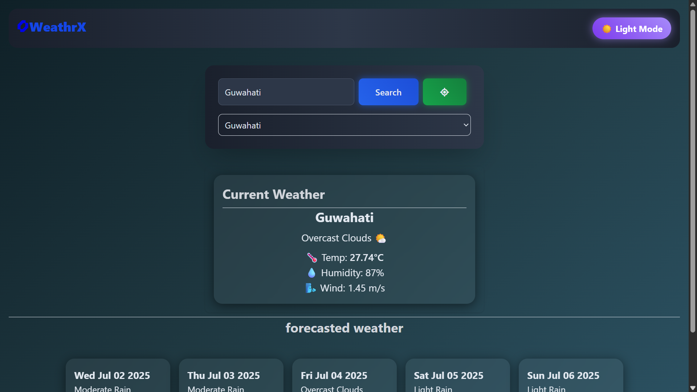

#  WeathrX — A Sleek Weather Forecast App

WeathrX is a responsive weather app built using **vanilla JavaScript** and **Tailwind CSS**, with support for **dark/light mode**, **location detection**, and **forecasting**. It fetches real-time weather data using the **OpenWeatherMap API**.

---

## 🖼️ Screenshots
### Light Mode vs Dark Mode
<p align="center">
  
  
</p>

<p align="center">
  
  
</p>


> 💡 You can toggle the theme using the button on the top right of the header.

---

## 🚀 Features

- 🔍 Search the weather by city name
- 📍 Detect and show the weather at your current location
- 🕒 5-day forecast with responsive cards
- 🌓 Light/Dark mode toggle (with localStorage support)
- 💾 Stores recent searches
- 🎨 Smooth animations for card transitions
- 🔥 Fully responsive layout (mobile & desktop)

---

## 🛠️ Technologies Used

| Type           | Libraries / Tools          |
|----------------|----------------------------|
| Frontend       | Vanilla JavaScript         |
| Styling        | Tailwind CSS               |
| API            | OpenWeatherMap API         |
| Icons & Emojis | Unicode / System fonts / Font Awesome    |
| Animations     | Custom CSS Keyframes + Tailwind transitions |

---

## ⚙️ Folder Structure
```bash
weather-app/
├── index.html
├── script.js
├── output.css
├── input.css
├── screenshots/
│   ├── light-mode.png
│   └── dark-mode.png
└── README.md

